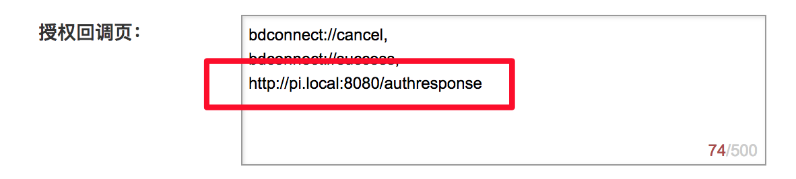

# Go实现的DuerOS SDK

[](https://asciinema.org/a/RQB9mOsQ0oigdu4ZGKOkSuMIF)

## 环境依赖

### Mac

``` shell
brew install portaudio
brew install mpg123
brew install pkg-config
brew install swig
```

### 树莓派

```
sudo apt-get install portaudio19-dev
sudo apt-get install libmpg123-dev

# 由于树莓派自带的swig版本太低，需要手动编译
sudo apt-get install libpcre3-dev
wget http://prdownloads.sourceforge.net/swig/swig-3.0.12.tar.gz
tar xzf swig-3.0.12.tar.gz
cd swig-3.0.12
./configure && make && sudo make install
```

## 编译dueros

```
go get -d github.com/icexin/dueros
cd $GOPATH/src/github.com/icexin/dueros
go build
```


## 运行

#### 第一步，设置百度的oauth回调地址


#### 第二步，配置host
编辑`/etc/hosts`

- 如果运行在树莓派上就配置树莓派的ip，例如树莓派的地址为192.168.1.2，则配置`192.168.1.2 pi.local`
- 如果运行在本机，则配置`127.0.0.1 pi.local`

#### 第三步，运行的时候指定client_id和client_secret

第一次运行需要指定`client_id`和`client_secret`参数

`dueros --client_id=$id --client_secret=$secret`

#### 第四步，授权

在浏览器输入`http://pi.local:8080/login`，按照提示进行授权，完成之后会在当前目录下生成token.json

目录下生成`token.json`之后再运行就不需要进行授权了

### 如果没有百度账号，也直接使用别人的access_token，

通过运行的时候指定 `--access_token`，就不需要之前的步骤直接运行，当然得需要别人给你access_token

## 唤醒

`--wakeup` 参数指定唤醒方式，有`keyboard`和`keyword`两种方式，分别对应敲击回车和语音关键字来唤醒机器人 :)

默认是语音唤醒

当屏幕上出现 `>>> 等待唤醒`的时候就可以使用了，说`小度小度`后，听到`叮`的一声后，说一句`唱首歌儿`


## 替换唤醒词

1. 进入 https://snowboy.kitt.ai/
2. 训练好唤醒词之后，替换`resource/wakeup.pmdl`
3. 重新启动程序


## Bug

部分程序代码实现功能并没有严谨推敲，另外部分地方并不是协程安全，欢迎批评交流。

# LICENSE
```
MIT License

Copyright (c) 2017 fanbingxin

Permission is hereby granted, free of charge, to any person obtaining a copy
of this software and associated documentation files (the "Software"), to deal
in the Software without restriction, including without limitation the rights
to use, copy, modify, merge, publish, distribute, sublicense, and/or sell
copies of the Software, and to permit persons to whom the Software is
furnished to do so, subject to the following conditions:

The above copyright notice and this permission notice shall be included in all
copies or substantial portions of the Software.

THE SOFTWARE IS PROVIDED "AS IS", WITHOUT WARRANTY OF ANY KIND, EXPRESS OR
IMPLIED, INCLUDING BUT NOT LIMITED TO THE WARRANTIES OF MERCHANTABILITY,
FITNESS FOR A PARTICULAR PURPOSE AND NONINFRINGEMENT. IN NO EVENT SHALL THE
AUTHORS OR COPYRIGHT HOLDERS BE LIABLE FOR ANY CLAIM, DAMAGES OR OTHER
LIABILITY, WHETHER IN AN ACTION OF CONTRACT, TORT OR OTHERWISE, ARISING FROM,
OUT OF OR IN CONNECTION WITH THE SOFTWARE OR THE USE OR OTHER DEALINGS IN THE
SOFTWARE.
```
